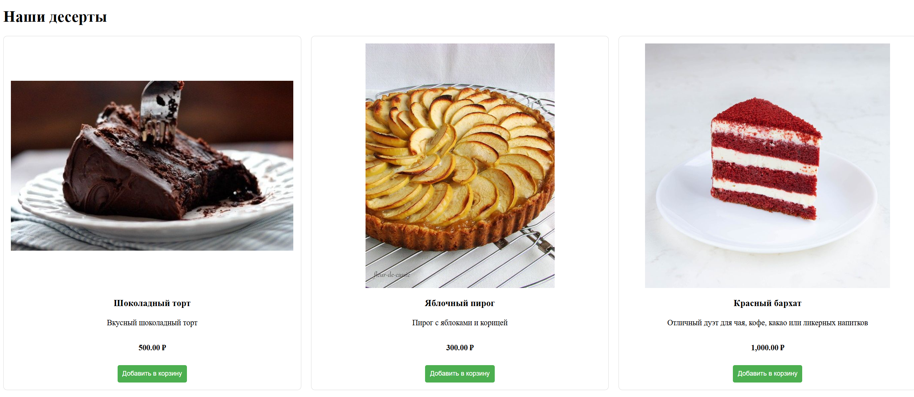

# Проект: Магазин десертов (`dessert_shop`)

## Описание лабораторной работы

Мой проект представляет собой веб-приложение, сделанное для онлайн-продажи десертов. Основная цель — изучение основ построения информационных систем, работы с базой данных MySQL, а также реализации авторизации, корзины и административных функций.

## Инструкции по запуску проекта ()
Инструкции по запуску проекта
1. Создайте базу данных `dessert_shop`.
2. Импортируйте SQL-структуру, если необходимо.
3. Разместите проект в папке веб-сервера (`htdocs` или `www`).
4. Перейдите в браузере по адресу:  
   `http://localhost/dessert_shop/index.php`

## Содержание

- Главная страница с десертами
- Авторизация и регистрация
- Корзина и оформление заказа
- Админ-функции (удаление десертов)
- Загрузка изображений десертов
- Уведомления о действиях

## Функциональные возможности

- Просмотр всех десертов (без авторизации)
- Добавление в корзину (только после входа)
- Регистрация и вход в систему
- Загрузка изображений при добавлении новых десертов
- Роль администратора с возможностью удаления товаров
- Хранение корзины в сессии
- Отображение placeholder, если отсутствует изображение

## Сценарии взаимодействия пользователей

**Гость:**
- Может просматривать все десерты
- Видит предложение войти для покупки

**Зарегистрированный пользователь:**
- Может добавлять товары в корзину
- Может просматривать корзину и переходить к оформлению заказа

**Администратор:**
- Имеет все возможности пользователя
- Может удалять десерты

## Структура базы данных (таблица `users` и `desserts`)

### `users`
| Поле        | Тип           | Описание              |
|-------------|----------------|------------------------|
| id          | INT (PK, AI)   | Уникальный идентификатор |
| username    | VARCHAR(50)    | Имя пользователя       |
| email       | VARCHAR(100)   | Электронная почта      |
| password    | VARCHAR(255)   | Хеш пароля             |
| role        | VARCHAR(20)    | Роль (user/admin)      |
| created_at  | DATETIME       | Дата регистрации       |

### `desserts`
| Поле        | Тип           | Описание              |
|-------------|----------------|------------------------|
| id          | INT (PK, AI)   | Уникальный идентификатор |
| name        | VARCHAR(100)   | Название десерта       |
| description | TEXT           | Описание десерта       |
| price       | DECIMAL(10,2)  | Цена                   |
| image       | VARCHAR(255)   | Путь к изображению     |

## Примеры использования проекта

### Пример карточки десерта:
```php
<div class="dessert">
  " alt="">
  <h3><?php echo htmlspecialchars($dessert['name']); ?></h3>
  <p><?php echo htmlspecialchars($dessert['description']); ?></p>
  <p><strong><?php echo number_format($dessert['price'], 2); ?> ₽</strong></p>
</div>
```

### Главная страница



###  Список десертов


###  Форма добавления десерта


###  Вход


###  Список пользователей (админка)


### Регистрация


### Структура папок


## Ответы на контрольные вопросы

1. **Как реализована авторизация?**  
   С помощью формы входа, сравнивающей введённые данные с хешем пароля из базы данных.

2. **Как работает корзина?**  
   Используются сессии PHP. Десерты добавляются в массив `$_SESSION['cart']`.

3. **Что происходит при выходе из аккаунта?**  
   Уничтожается сессия (`session_destroy()`), и пользователь перенаправляется на главную страницу.

4. **Как обрабатываются изображения?**  
   Загружаются в папку `uploads/images/`. Если файл не загружен, используется `placeholder.jpg`.

5. **Как защищено приложение?**  
   Применяется экранирование вывода (`htmlspecialchars`). Пароли хешируются с использованием `password_hash()`.

## Список использованных источников

- [PHP Manual](https://www.php.net/)
- [W3Schools PHP Tutorial](https://www.w3schools.com/php/)
- Stack Overflow (поиск решений ошибок)
- [Bootstrap](https://getbootstrap.com/)
